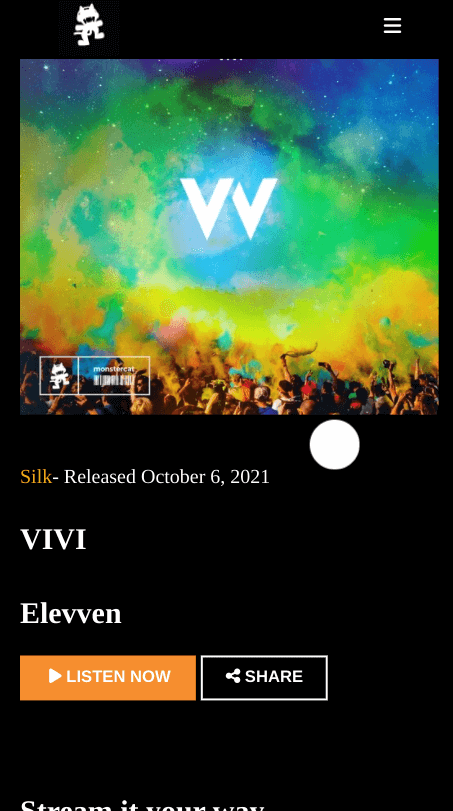

<h1 align="center">Monstercat</h1>

   Solution for a challenge from  <a href="https://frontendpractice.com" target="_blank">Frontendpractice.com</a>.

  <h3>
    <a href="https://jdegand.github.io/monstercat">
      Github Pages
    </a>
     | 
    <a href="https://www.frontendpractice.com/project/monstercat">
      Frontend Practice    
    </a>
  </h3>

## Table of Contents

- [Overview](#overview)
  - [Built With](#built-with)
- [Features](#features)
- [Useful Resources](#useful-resources)

## Overview

### Built With

- Grid
- Flex

## Features

The [challenge](https://www.frontendpractice.com/project/monstercat) was to build an application to complete the following user stories:

- [x] User story: Recreate the layout
- [ ] User story: Create a working play & pause button with your song of choice.
- [ ] User story: Add the sticky audio controls menu in the top right as you scroll down. (Outdated?)

## Useful Resources

- [Monstercat](https://www.monstercat.com/release/MCS1273)
- [Font Awesome](https://fontawesome.com/v5.15/icons?d=gallery&p=2) - Icons
- [Codepen](https://codepen.io/clementGir/pen/RQqvQx) - Cursor blend mode
- [Dev.to](https://dev.to/mattmarquise/how-to-create-a-custom-circular-cursor-for-your-website-4i7p) - circular cursor
- [Forum](https://forum.freecodecamp.org/t/can-we-place-audio-tag-inside-button-tag/247611) - audio tag inside button tag?
- [Catswhocode](https://catswhocode.com/html-audio-tag/) - Audio tag
- [YouTube](https://www.youtube.com/watch?v=b4EgP8f3wkU) - Vivi
- [Drivereasy](https://www.drivereasy.com/knowledge/extract-audio-from-youtube-video/)
- [Stack Overflow](https://stackoverflow.com/questions/54602553/custom-cursor-cant-click-on-dom-elements)
